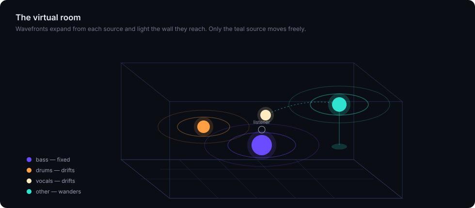
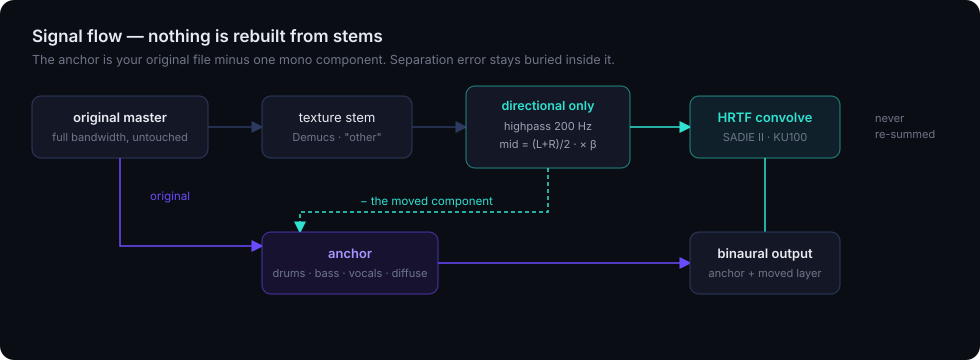

<div align="center">

# DiveAudio

### High-fidelity binaural spatialisation for music — runs entirely on your machine

[](LICENSE)
[](https://python.org)
[](https://www.york.ac.uk/sadie-project/database.html)
[](https://github.com/adefossez/demucs)
[](#quickstart)



</div>

---

## Why this exists

Most "8D audio" takes a finished stereo mix, swings the **whole thing** around your
head on an LFO, and drowns it in reverb. It's striking for thirty seconds and
exhausting after two minutes — because your ears know a drum kit does not orbit
the listener.

DiveAudio moves almost nothing. The rhythm section stays welded in place, one
textural layer wanders, and vocals drift so slowly they take half a song to cross
a small arc. The 3D view shows you exactly which is which, live, driven by the
same maths that rendered the audio.

## The core idea

Demucs separates the track into stems — but the stems are **never re-summed** to
produce output. Re-summing bakes every separation artifact into everything you
hear. Instead the signal is split in two:

```
mover_dry = beta · mid( highpass( texture_stem ) )    # the only thing that moves
anchor    = original_master − mover_dry               # literally everything else
```



`anchor` is your original file minus one mono component. Drums, bass, vocals, the
diffuse reverb field and the full bandwidth survive **untouched** — never
HRTF-filtered, never reconstructed by a model, never band-limited to Demucs'
44.1 kHz working rate. Every gram of separation error stays buried inside the
anchor, masked by the very signal it was subtracted from.

Only the **directional** (mid) component of the texture layer is convolved with
SADIE II KU100 HRTFs. The **diffuse** (side) component is left entirely alone.

> **This is the whole trick, and it was learned the hard way.** Two earlier
> designs rendered the full texture layer and came out measurably *narrower* than
> the source — because HRTF point-rendering an already-diffuse signal makes it
> **more** correlated, not less. Steer what is directional; preserve what is diffuse.

## Measured

96 kHz / 24-bit reference track, default preset:

| metric | source | output | |
|---|---:|---:|---|
| interaural correlation *(lower = wider)* | 0.794 | **0.562** | genuinely wider |
| IACC above 2 kHz | 0.562 | **0.036** | near-total decorrelation |
| directional motion above 2 kHz | 0.64 dB | **11.92 dB** | real movement |
| sub-200 Hz correlation *(must not change)* | 0.988 | 0.987 | bass provably anchored |
| >22 kHz content retained through separation | — | **99.87%** | full band survives |

The last row is the point of the subtraction design: Demucs works at 44.1 kHz,
yet the original's ultrasonic content is still there in the output.

## Quickstart

```bash
git clone https://github.com/dillongraveline/DiveAudio.git
cd DiveAudio
./setup.sh                     # venv, deps, three.js, SADIE HRTF database
./.venv/bin/python server.py   # binds 0.0.0.0:8765
```

Open `http://localhost:8765`, or your machine's LAN IP from a phone or tablet.
Point it at your music by editing `config.json`, or drag files onto the sidebar.

Everything runs on your machine. No account, no upload, no cloud.

## Three modes

Switching between them **never interrupts playback**. Changing `src` on an audio
element tears down its buffer, so there are two: the outgoing stream keeps
playing while the incoming one loads and seeks to the same timestamp, and only
once it can actually play do the two cross-fade. That holds even when the target
still has to be rendered — you keep listening to what you had, with progress on
the header ring rather than a blocking overlay, until the moment it is ready.

| mode | what you hear | render |
|---|---|---|
| **Off** | your original file, untouched | none — instant |
| **Enhanced** | the `default` preset | one HRTF mover |
| **Stage Simulator** | `stage` — the vocal walks a stage too | two HRTF movers |

**Every mode is loudness-matched**, or the comparison is worthless. Peak
normalising a render costs real level — subtracting the mover and adding an
HRTF'd copy back raises the peak far more than the loudness, about **7.9 dB**
against a limited master — so `Off` would simply sound better by being louder.
The renders cannot be raised to meet it: they would clip, and limiting them
would spend exactly the fidelity this design protects. So the player attenuates
every mode to the quietest of them and **never boosts anything**. Each render
records its own A-weighted level, sources are measured directly, and the trim in
use is shown next to the mode buttons. On a 9:38 track it takes the spread from
8.5 dB to 0.34 dB overall, and 1.09 dB to 0.27 dB in the vocal band.

`Off` is the honest baseline for an A/B: no processing, no wait. Because nothing
is being steered, the 3D view **holds still** rather than animating motion the
audio does not contain. The download button always gives you whatever is
selected. `subtle`, `natural` and `wide` remain available from the CLI.

### What `Stage Simulator` adds

It HRTF-renders the vocal's directional mid as well, along a **bounded front arc**
rather than the free wander — a singer works a stage in front of you, they do not
orbit your head. The same subtraction design applies, so the diffuse part of the
vocal is never touched. Measured on a 9:38 track:

| IACC *(lower = wider)* | source | `default` | `stage` | |
|---|---:|---:|---:|---|
| full band | 0.836 | 0.603 | **0.565** | wider |
| vocal band 300 Hz–4 kHz | 0.581 | 0.027 | **−0.090** | wider |
| above 2 kHz | 0.498 | 0.251 | **0.128** | wider |
| sub-200 Hz *(must not change)* | 0.987 | 0.984 | 0.984 | bass still anchored |

The narrowing failure mode this architecture exists to avoid did **not** occur —
vocals are dry and direct enough that their mid really is directional. Isolating
what the mode adds (`stage − default`, 11.6 dB below the mix), its interaural
delay tracks the intended path in **98%** of windows, swinging ±291 µs against a
~700 µs full-head width and crossing centre 48 times per song. The vocal drift it
replaces crossed centre **zero** times in the same track.

## How motion works

Nothing follows a circle. The wandering source uses **sums of sines with
pairwise-incommensurate periods** (97 / 61 / 37 s in azimuth, 71 / 43 s in
elevation), so the path never repeats — yet it stays a pure function of time,
which means the renderer and the browser compute the identical trajectory
independently. RMS angular speed is ~7.8 °/s.

The anchored sources drift by **constant-power amplitude panning, never HRTF** —
level only, so their timbre is untouched. Depth is low and the period is 1.7× the
track length, which is deliberately slower than the ear tracks: on a 9:38 track
the drift never completes a pass. That subtlety is the point for drums; it is
also exactly why `Stage Simulator` exists for vocals.

**Bass never moves.** Low-frequency panning is inaudible and only muddies the
centre.

| | stem | Enhanced | Stage Simulator | HRTF? |
|---|---|---|---|---|
| 🟣 | bass | fixed, dead centre | fixed, dead centre | never |
| 🟠 | drums | drifts by amplitude pan | drifts by amplitude pan | never |
| ⚪ | vocals | drifts by amplitude pan | **walks a front arc** | under `stage` |
| 🟢 | other | wanders freely | wanders freely | **always** |

A stem is steered one way or the other, never both: when the vocal is
HRTF-rendered it leaves the amplitude-pan drift entirely.

## What the 3D view shows

Orb size is driven by **real per-stem RMS envelopes** computed at separation time,
not by frequency bands of the mix — so each orb pulses with its own instrument.

Wavefronts reflect off the walls by the **image-source method**: a reflection is a
virtual source mirrored across the wall plane, so the reflected front expands from
that mirror point on the same clock and becomes visible only once the direct front
has actually reached the wall. A clipping plane per wall hides the half outside
the room, so the front reads as coming off the surface.

> **Left is left.** SOFA is `+y = left`; three.js is `+x = screen-right`, so the
> mapping needs a sign flip. It was missing, and every HRTF-rendered position was
> drawn **mirrored** — the orb sat right while the sound came from the left.
> `tests/test_orientation.py` pins the convention against the SADIE data itself
> (azimuth +90° is 5.8× louder and 22 samples earlier in the left ear), and
> `tests/test_path_parity.py` holds the browser's trajectory against the
> renderer's, so the claim that the picture matches the audio is now checked
> rather than asserted.

## CLI

```bash
./.venv/bin/python spatialize_cli.py track.flac
```

| flag | default | meaning |
|---|---|---|
| `--preset` | — | `subtle` · `natural` · `default` · `wide` · `stage` |
| `--beta` | 0.92 | fraction of the texture layer that moves |
| `--orbit` | 43 | motion time-base, seconds |
| `--xover` | 200 | Hz below which nothing moves |
| `--elev` | 25 | vertical excursion of the wandering source, degrees |
| `--ramp` | 20 | seconds over which the motion fades in from centre |
| `--stem` | other | which layer becomes the mover |
| `--model` | htdemucs | `htdemucs_ft` is better and ~4× slower |
| `--shifts` | 0 | prediction averaging; raises quality and cost |
| `--vocal-beta` | 0 | fraction of the vocal mid to HRTF-render; 0 disables |
| `--vocal-arc` | 55 | half-width in degrees of the stage the vocal walks |
| `--vocal-elev` | 9 | vertical excursion of the vocal path, degrees |
| `--batch` | auto | HRTF blocks per batched transform; auto-sized to a 128 MB budget |
| `--out` | *alongside input* | where to write the rendered FLAC |
| `--json` | off | print the result metadata as JSON instead of a one-line summary |

Progress is printed as it happens, interleaving human lines with machine-readable
`@@PROG {...}` lines that the server parses (see `progress.py`).

## Cache correctness

Stems cache per input file, built so that a stem from one song appearing in
another's mix is **structurally impossible**:

- keys are a **SHA-256 of file content**, never path or mtime
- separation runs in a temp dir and is **atomically renamed** into place, so a
  killed job never leaves a half-written entry to be read later
- every entry carries a **manifest** (source hash, duration, filename); a cache
  hit requires it to match *this* file, with all four stems matching its duration
- a **length mismatch at point of use raises** rather than padding silently
- an `flock` per key serialises concurrent runs on the same file

First separation takes minutes; every render after it takes seconds.

### Renders cache too

Stems were content-addressed from the start; **renders are as well**. A render is
keyed on `(source content, preset, DSP version)` and written to a deterministic
path with a metadata sidecar, so:

- clicking a track you have already rendered is a **lookup, not a render** — it
  starts playing in milliseconds instead of re-running the pipeline
- the cache survives a restart, which is what lets the page restore your last
  track on load without starting any work
- renaming or moving a file still hits its render; changing preset does not
- a render is only served if its sidecar's byte count matches the file on disk,
  so a job killed mid-encode can never be mistaken for a finished one
- on startup, renders that no valid metadata claims are swept; the directory is
  then held under `max_render_gb` in `config.json` (default 10) by dropping
  least-recently-used entries, never the one currently playing

Before this, every click produced a fresh job and another copy of the same audio.

## While it renders

The processing view is a ring whose **segments are sized by each stage's measured
share of the wall clock**, so its shape is the answer to "what is taking the
time" — separation dominates a cold render and is absent entirely from a warm
one, and the ring visibly redraws to say so. Under it, the live detail line
reports the renderer's own units:

```
HRTF CONVOLUTION
9,816 / 12,448 blocks · batch 409 · 4,096 window / 2,048 hop
· 256-tap HRIR @ 44,100 Hz · 1,897 positions · 8,482 blk/s
```

Demucs' own progress bar is parsed into the same channel, so separation reports a
real percentage rather than a spinner.

## Formats

Decoding uses libsndfile, falling back to macOS `afconvert` — so WAV, FLAC, OGG,
MP3, M4A, AAC and ALAC all work with **no ffmpeg required**.

> MP3 container headers routinely overstate duration (encoder delay and padding —
> one test file claimed 346.9 s and decoded to 340.8 s). All duration checks use
> the decoded audio, never the header.

Output downloads as lossless FLAC, or AAC in M4A at roughly 1/6 the size.

## Playing in the browser

`Off` streams your original file from `/api/source`, which takes a path — so it
serves **only paths already in the library index**. Traversals and anything
outside your configured music directories are refused, because the server binds
`0.0.0.0` with no authentication and a path parameter must never become a way to
read arbitrary files off the machine.

The player builds its Web Audio graph **only inside a real user gesture**, and
only once the AudioContext is confirmed running. Safari starts a context
suspended unless it is created from a gesture, while `createMediaElementSource`
*permanently* reroutes the element into that context — do both off a programmatic
`play()` and the element ends up feeding a graph that never runs. Controls move,
the scrubber advances, and there is no sound at all, irreversibly. If the context
cannot be started the elements simply keep their native output; the visualiser
does not need it, because per-stem levels come from the server's envelopes.

## Known limitations

- **No authentication.** Binding `0.0.0.0` exposes your library to the LAN.
- **FLAC output is large** (~90 MB for 4 min at 96/24). Use the M4A download for phones.
- Cached renders are large for the same reason; `max_render_gb` in `config.json`
  bounds the directory (default 10 GB).
- Motion parameters are not yet derived from tempo.
- Peak memory is roughly 7 GB on a ten-minute track: the pipeline holds several
  full-length float64 buffers at once rather than streaming.
- Binaural output is **for headphones**; it partially collapses on speakers.
- `afconvert` decoding is macOS-only; other platforms are limited to what
  libsndfile handles.

## Tests

```bash
./.venv/bin/python -m pytest tests/ -q
```

The suite pins the parts where a mistake would be silent rather than loud:

| file | what it holds |
|---|---|
| `test_dsp.py` | batched HRTF convolution against a verbatim copy of the per-block loop it replaced |
| `test_mid_highpass.py` | filtering the mid channel equals filtering both and collapsing |
| `test_envelope.py` | streaming RMS envelopes match the whole-file computation |
| `test_progress.py` | the progress channel survives real subprocess output and skipped stages |
| `test_render_cache.py` | keying, truncated-render rejection, LRU pruning, orphan sweeping |
| `test_server.py` | a second click never starts a second render; `/api/source` refuses anything outside the library |
| `test_orientation.py` | left is left: the drawn position matches the ear the sound actually favours |
| `test_path_parity.py` | the browser and the renderer compute the same trajectory |
| `test_paths.py` | the vocalist stays on the stage and in front of the listener |
| `test_loudness.py` | A-weighted measurement, including that it discounts bass and notices decorrelation |
| `test_ui.py` | ring geometry, the detail formatter, and that every `$("#id")` resolves |

`tests/check_ui.js` and `tests/dump_paths.js` run under node and are skipped if
node is absent. Two tests are worth calling out as the pattern the rest follow:
`test_dsp.py` keeps a **verbatim copy** of the loop it replaced and holds the new
implementation against it, and `test_orientation.py` reads the SADIE file to
establish which ear is which rather than trusting the specification.

## Credits

[SADIE II binaural database](https://www.york.ac.uk/sadie-project/database.html)
(Apache-2.0) — Neumann KU100 dummy head, 8802 measurements at 96 kHz.
Separation by [Demucs](https://github.com/adefossez/demucs) (MIT).
Rendering with [three.js](https://threejs.org) (MIT).

Licensed under the [MIT License](LICENSE).
